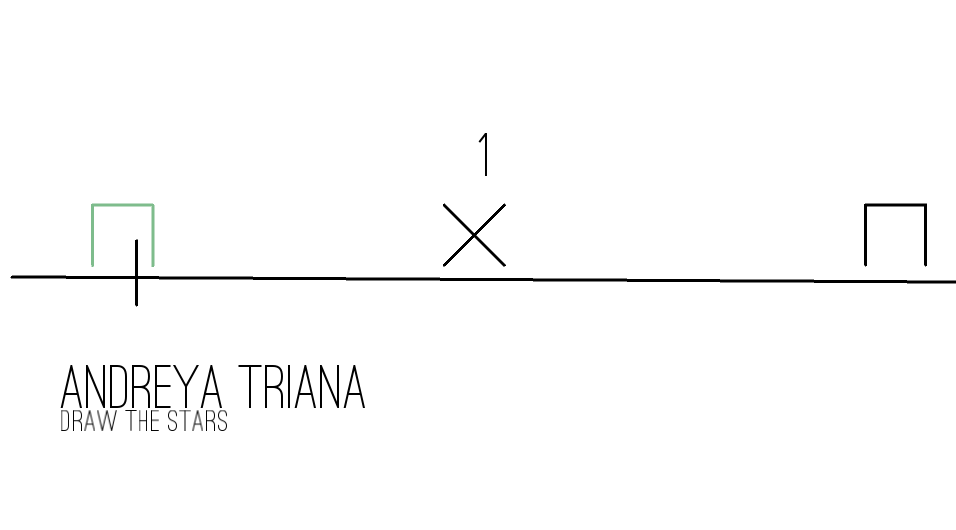

# neovib
neovib is a simple rhthym game inspired by classic rhthym games like Osu!
and Vib-Ribbon. In Neovib the user provides an audio file / selects a random
audio file from their music library and the game will automatically generate
obstacles that coincide with musical onsets in the game. It's an early state
currently but works on Linux. 

# Screenshot

# Footage

# Controls

|Button | Action|
|-------|-------|
|k      | Travel up in a menu|
|j      | Travel down in a menu|
|m      | Mark a directory (used for marking your music librray)|
|q      | Cancel the current action / return to the previous screen|
|a      | Press when a Cross is coming |
|s      | Press when a Circle is coming |
|d      | Press when a Square is coming |
|f      | Press when a Triangle is coming |

# Try It
Neovib requires java8. The project doesn't correctly import in Eclipse at the moment but works 
fine in Intellij. You can try it without compiling it by downloading the folder dist.zip but 